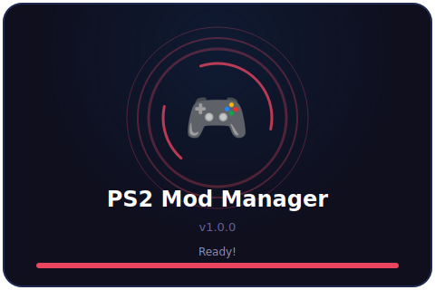
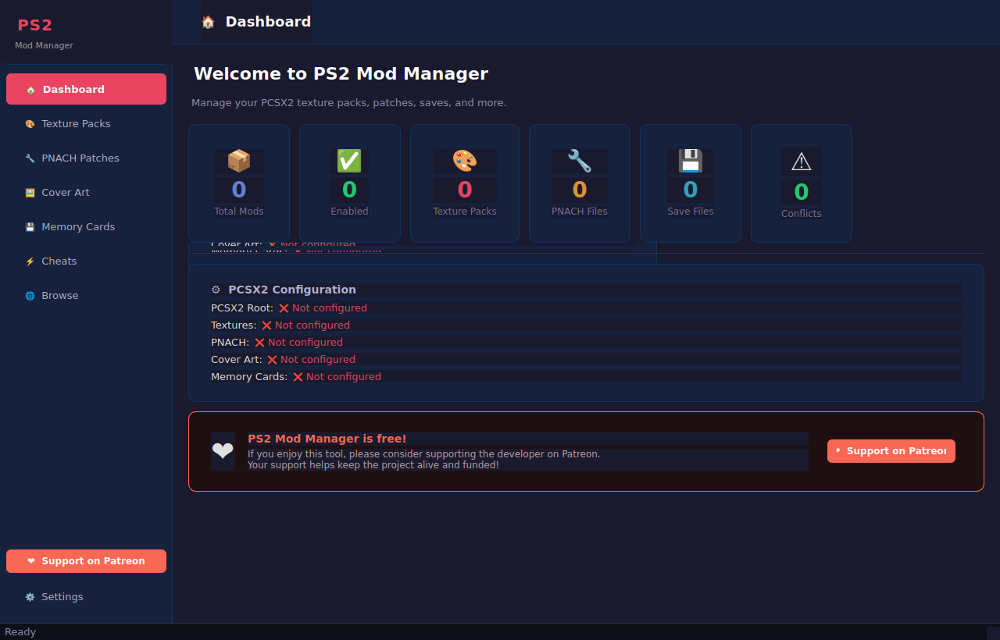
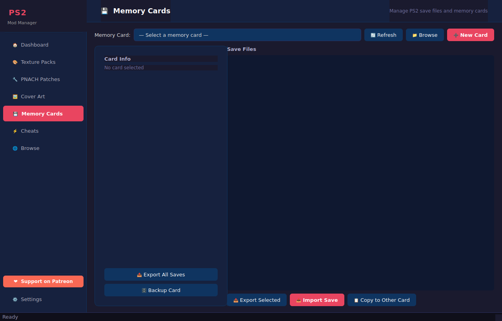
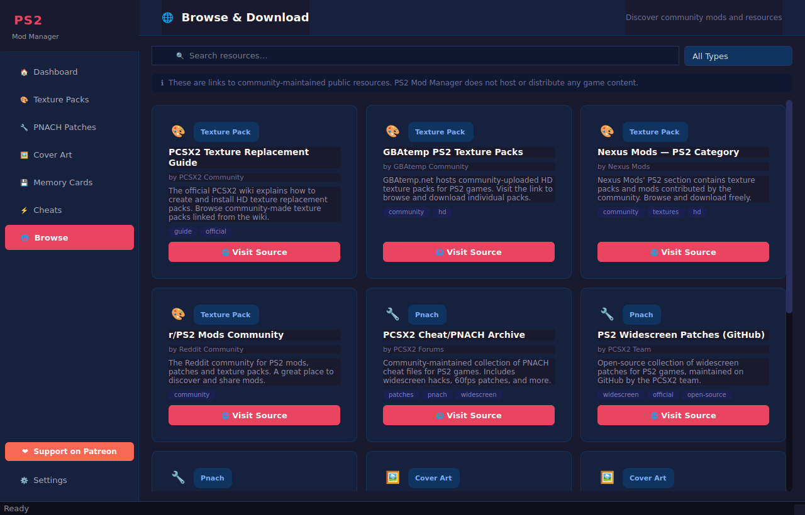

<p align="center">
  
</p>

<h1 align="center">PS2 Mod Manager</h1>

<p align="center">
  A modern, feature-rich desktop application for managing PCSX2 mods, texture packs,
  save files, PNACH patches, cover art, and cheats — all in one place.
</p>

<p align="center">
  <a href="https://www.patreon.com/c/DeadOnTheInside">
    
  </a>
  
  
  
</p>

---

## ✨ Features

### 🎨 Texture Pack Manager
- Import HD texture replacement packs (ZIP, 7z, folder)
- **Multi-part archive support** — packs split across `_Part1.zip`, `_Part2.zip` … (or 7-zip volumes) are extracted automatically; the import dialog detects all sibling parts and warns about any that are missing
- **Auto folder normalization** — packs that ship with a `replacement/` folder (common in Patreon releases) are automatically placed into the correct `textures/<SERIAL>/replacements/` layout when a Game ID is provided
- Enable/disable individual packs without deleting them
- Set priority order — higher-priority packs win conflicts
- Greyed-out **"Completely Shadowed"** badge when a pack is 100% overridden by a higher-priority one
- One-click **Deploy** to push enabled packs to PCSX2
- **👤 See more by [author]** quick-filter button on every mod item
- **Cross-panel navigation** — "Find PNACH by this author" opens the PNACH panel pre-filtered

### 🔧 PNACH Patch Manager
- Manage `.pnach` game patches (widescreen, 60fps, gameplay tweaks)
- Enable/disable per-game patches independently
- **Automatic PNACH merging** — multiple enabled patches for the same game CRC are merged into one output file on deploy
- Address-level conflict detection between overlapping patch addresses

### 🖼️ Cover Art Manager
- Store and deploy cover art for PCSX2's game browser
- Cover art is automatically renamed to `{SERIAL}.png` (e.g. `SLUS-20062.png`) on deploy — the exact format PCSX2 expects
- **One cover art per game** — enabling a second cover for the same serial offers to auto-disable the other
- Download cover art from **GameTDB** (free, by game serial ID)

### 💾 Memory Card & Save File Manager
- Browse all `.ps2` / `.mcd` memory card images
- List and export individual saves
- **Import** a save dump back into a memory card
- **Copy** a save between memory card images
- **Backup** any card with a timestamped copy

### ⚡ Cheats Manager
- Manage widescreen and other `.pnach`-format cheat files

### 🌐 Browse & Download
- Curated catalogue of **213 entries** across texture packs, PNACH patches, cover art, cheats, and community hubs — GBAtemp, LoversLab, PS2-Home, PSX-Place, PCSX2 Forums, Archive.org, Reddit, GameTDB, LaunchBox, GameFAQs, Patreon, GitHub, PS2Wide, MediaFire, and more
- **53 DeadOnTheInside Patreon entries** — every known HD texture pack and PNACH patch from the developer, covering 40+ popular PS2 titles (God of War, Kingdom Hearts, Final Fantasy X/XII, Shadow of the Colossus, Silent Hill 2/3, Devil May Cry, Resident Evil 4, Metal Gear Solid 2/3, Okami, and many more)
- **GBAtemp community packs with direct download** — e.g. DurinDragon's 3 Spyro: A New Beginning variants (6x+Extra Detail, 6x Only, 4x Anime), each with a one-click in-app MediaFire download
- **🔍 Scan GBAtemp Post** button — paste any GBAtemp thread URL to auto-discover the author, game serial, and all download links; every link offers a one-click install
- **MediaFire auto-resolve** — MediaFire file-page links are automatically resolved to direct download URLs so they work with the built-in downloader
- **Browse** is the first panel after Dashboard for quick access
- Every catalogue card shows both **🌐 Visit Source** and **⬇ Download from URL** buttons
- **Source**, **author**, and **favorites-only** filter dropdowns
- **Content-type filter row:**
  - 💰 **Show Paid** — hidden by default; toggle to reveal subscription-only packs
  - 🔐 **Show Account-Required** — toggle to hide/show sources requiring a free or paid account
  - 🔧 **Show Incomplete/Partial** — toggle to show/hide WIP or partial-coverage packs
- Status badges on every card: **💰 Paid**, **🔐 Account**, **🔧 WIP/Partial** shown where applicable
- **Result count label** — "Showing X of Y entries" updates live as filters change
- **✖ Clear Filters** button — resets all filter controls in one click
- Async thumbnail loading per card — thumbnails loaded in background without blocking the UI
- ❤ **Favorite authors** toggle — mark authors you follow; favorites shown first
- Download cover art by game ID directly from GameTDB
- **Download from URL** — paste any HTTPS link (ZIP, 7z, PNACH, PNG); Google Drive share links auto-converted
- **🔧 Fetch PNACH from GitHub** — browse and install official PCSX2 widescreen patches
- Patreon support banner links directly to the developer's creator page

### 🔍 Conflict Detection & Resolution
- Automatically detects file-level conflicts between enabled mods
- **Per-file resolution** — expand a conflict to pick A or B winner for each individual file
- "A wins all / B wins all / Allow both" quick-resolve buttons
- Address-level PNACH conflict detection for overlapping patch addresses
- Visual conflict indicator per mod item

### 👤 Author Quick Navigation
- **"See more by [author]"** button on every mod item — filters current panel to that author instantly
- **Cross-type navigation** from Mod Details dialog:
  - "Find PNACH by [author]" — navigates to PNACH panel pre-filtered
  - "Find textures by [author]" — navigates to Texture Packs panel pre-filtered
- Author filter dropdown in every mod panel

### 🔎 Game Serial Recognition
- Automatically detects PS2 game serials (SLUS/SCUS/SLES/SLPS/SLPM/SLCD/SCPS and more) from filenames and file contents
- 390+ built-in serial → game title lookups
- Used for cover art naming, thumbnail fetching, and display in mod items

### 🔔 Update Checking
- **"🔔 Updates" toolbar button** in every mod panel — runs a targeted update check for visible mods
- Background check on startup for mods with a GitHub Releases source URL
- Status-bar notification when updates are found

### ⚙️ Settings & Setup Wizard
- Guided setup wizard on first launch
- Auto-detection of PCSX2 config sub-folders
- All paths configurable individually

### 🚀 Animated Splash Screen
- PS2 controller icon with pulsing glow ring and rotating accent arc
- Loading progress bar

---

## 🖥️ Screenshots

| Splash Screen | Dashboard | Memory Cards | Browse |
|---------------|-----------|--------------|--------|
|  |  |  |  |

---

## 📋 Requirements

| Package | Version |
|---------|---------|
| Python | 3.10 + |
| PyQt6 | ≥ 6.6.0 |
| requests | ≥ 2.31.0 |
| Pillow | ≥ 10.0.0 |
| py7zr | ≥ 0.20.0 |

Install all runtime dependencies:

```bash
pip install -r requirements.txt
```

---

## 🚀 Running from Source

```bash
git clone https://github.com/JosephsDeadish/PS2-Texture-and-mod-manager-.git
cd PS2-Texture-and-mod-manager-
pip install -r requirements.txt
python main.py
```

---

## 📦 Building a Windows Executable

A pre-built Windows `.exe` is attached to every [GitHub Release](https://github.com/JosephsDeadish/PS2-Texture-and-mod-manager-/releases).

To build locally:

```bash
pip install -r requirements-build.txt   # adds pyinstaller
python assets/generate_icons.py         # regenerate icon files
pyinstaller PS2ModManager.spec --noconfirm
# Output: dist/PS2ModManager/PS2ModManager.exe
```

The CI workflow (`.github/workflows/build.yml`) builds automatically when a `v*` tag is pushed.

---

## 🧪 Running Tests

```bash
pip install pytest
python -m pytest tests/ -v
```

258 unit tests covering core logic, catalogue integrity, multi-part archive detection,
texture structure normalization, PNACH merging, memory card operations, and more.

---

## 🗂️ Project Structure

```
PS2-Texture-and-mod-manager-/
├── main.py                    # Entry point (splash + app init)
├── requirements.txt           # Runtime dependencies
├── requirements-build.txt     # + pyinstaller for EXE builds
├── PS2ModManager.spec         # PyInstaller spec
├── assets/
│   ├── icon.svg               # PS2 controller SVG icon (source)
│   ├── icon.ico               # Windows multi-resolution icon
│   ├── icon_{16,32,48,256}.png
│   └── generate_icons.py      # Renders SVG → PNG + ICO
├── src/
│   ├── core/
│   │   ├── assets.py          # Asset path helpers (dev + frozen)
│   │   ├── config_manager.py  # Config load/save, PCSX2 path detection
│   │   ├── mod_manager.py     # Mod database + management logic
│   │   ├── game_registry.py   # PS2 serial detection + title lookup
│   │   ├── memory_card.py     # PS2 memory card read/write
│   │   ├── archive.py         # ZIP/7z extraction
│   │   ├── pnach.py           # PNACH parse, merge, conflict detection
│   │   ├── downloader.py      # HTTPS download + GameTDB cover art
│   │   └── updater.py         # Background mod update checker
│   ├── models/
│   │   └── mod.py             # Data models (ModInfo, AppConfig…)
│   └── ui/
│       ├── splash.py          # Animated startup splash screen
│       ├── theme.py           # Dark theme stylesheet
│       ├── widgets.py         # Reusable UI widgets
│       ├── main_window.py     # Main application window
│       ├── setup_wizard.py    # First-run setup wizard
│       ├── dashboard.py       # Dashboard panel
│       ├── mod_panel.py       # Generic mod management panel
│       ├── import_dialog.py   # Import/edit mod dialogs
│       ├── memcard_panel.py   # Memory card panel
│       ├── browse_panel.py    # Browse & download panel
│       └── settings_panel.py  # Settings panel
├── docs/
│   └── screenshot_main.png
└── tests/
    └── test_core.py           # Unit tests for core logic (106 tests)
```

---

## ⚖️ Legal Notice

PS2 Mod Manager does not host, distribute, or include any copyrighted game content,
BIOS files, or game ISOs. All mod resources are links to publicly available community
content. Cover art is downloaded from [GameTDB](https://www.gametdb.com) which provides
free cover images. Users are responsible for ensuring they have the right to use any
mods, patches, or saves they manage with this tool.

---

## ❤️ Support

If you enjoy PS2 Mod Manager, please consider supporting the developer:

[](https://www.patreon.com/c/DeadOnTheInside)
